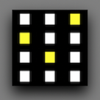
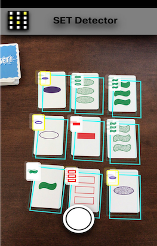
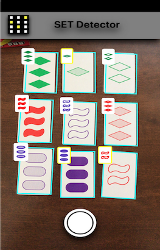

## SET Card Game

SET is a card game played with a specialized card deck. Each card has 4 properties and each property can take on 3 values. As a result, the deck consists of 3^4 cards, i.e. 81 cards. The four properties are color, shape, fill and shape count. The values they take on can differ across card deck manufacturers.

More on the SET card game and the rules can be found [here](https://en.wikipedia.org/wiki/Set_(card_game)).
More on the related trademarks can be found [here](https://trademarks.justia.com/870/43/set-87043548.html).

### SET Enterprises, Inc.

The deck manufactured by [Set Enterprises, Inc.](https://en.wikipedia.org/wiki/Set_Enterprises) features the following properties:
- red, green and purple for the 3 values of the color property
- diamond, oval and squiggle for the 3 values of the shape property
- filled, empty or striped for the fill property
- 1, 2 and 3 for the number of shapes

### SET!

The deck manufactured by unknown manufacturer features the following properties:
- red, green and purple for the 3 values of the color property
- rectangle, oval and squiggle for the 3 values of the shape property
- filled, empty or partially filled for the fill property
- 1, 2 and 3 for the number of shapes

### SET Detector

SET Detector is an iOS application designed to detect three cards that form a set among a collection of multiple SET cards as manufactured by Set Enterprises, Inc. or the unknown manufacturer depicted above.

The application uses a machine learning model that was trained to detect the shapes, the fill and the number of shapes on the cards. Their color is determined using image processing.

This application works in real time. Aim your device at a card deck and wait for it to detect the rectangle-shaped cards. Soon after the cards are detected, the application processes each card individually on a background thread to detect its properties. Once the properties have been detected, they will be used to draw the detected card in an augmented reality overlay. You should see the detected card match the real card, though depending on the external conditions such as lighting or card imperfections (stains, folds, etc.) this may take longer to detect or it may be imprecise. Once all properties have been identified on the cards an algorithm is executed to calculate if any of them form a set. There can be multiple sets of cards that form a set in any given group of cards. The application chooses only one and highlights it in yellow color.

You have a white button available on your screen to take a screenshot of what has been detected. You can use this to stop the application from running real-time and just display the results at that point in time. Swipe down to go back to real-time detection, but be aware that this will also dismiss the screenshot.

The app currently supports the two card decks described above.

### Demo

### Support

For any time of feedback use `set <dot> detector <dot> feedback <at> gmail <dot> com` email address.

We encourage you to write feedback about your experience with the detection feature of the app. It was trained on brand-new decks from the two manufactures as described above and tested in various environmental settings but hearing from you would be very valuable for us to know how this features performs in real world.

The screenshot feature is by design non-persistent. We do not store the screenshot in your photo album nor do we persist it in the cloud. Once you dismiss it you will need to take a new screenshot if you need one. We would love to hear your feedback on this design and persisting the screenshot would be preferrable.

The application calculates all the sets in the group of cards it detects but only highlights one. We would like to hear if you'd like to see them all highlighted.

As any app this app may crash. We are actively monitoring analytics provided by Apple Developer framework and rigorously testing the app to reduce the occurence of app crashes.
